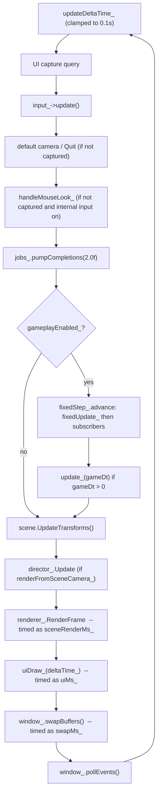

# Engine Architecture

Cat Splat Engine is a C++17 / OpenGL 3.3 engine built as a shared library (`Engine.dll`) with several thin executables linked against it. This page explains what those executables are, how the engine splits responsibilities between `Application` and `Renderer`, exactly what happens in one frame, how the render passes are chained, where EnTT fits, and how the DLL boundary is drawn.

Read this before you write your own `Application` subclass or add a render pass.

---

## The four executables

Everything is declared in the top-level `CMakeLists.txt`, which adds `Engine`, `Editor`, `Player`, and `Cooker`. The `Player` directory builds **two** executables from one source file, so there are four programs in total.

| Target | Output | Subsystem | Purpose |
|---|---|---|---|
| `Editor` | `Editor.exe` | console | The authoring tool. Links `Engine` plus `imgui` and `imguizmo`. Renders the scene into an offscreen target shown in its Viewport panel. |
| `PlayerDebug` | `PlayerDebug.exe` | console | The standalone game, with a terminal attached so `std::cout` logs are visible during development. |
| `PlayerShipping` | `Player.exe` | `WIN32` (no console) | The same source as `PlayerDebug`, built with `MYCE_SHIPPING=1` and `OUTPUT_NAME "Player"`. This is what gets packaged. |
| `AssetCooker` | `AssetCooker.exe` | console | Headless asset work. Links `Engine` but **never initializes GL** — every operation is CPU-only. Spawned by the editor as a child process. |

All four targets write into the same `build/bin/<Config>` directory, so they share one `Engine.dll` and one `Exported/` asset folder. That is deliberate: a scene saved from the editor is immediately runnable by the player with no copy step.

### Editor and cooker are coupled

`CMakeLists.txt` declares `add_dependencies(Editor AssetCooker)`. The editor spawns `AssetCooker.exe` at runtime (the Validate button), so building the editor must refresh the cooker too — otherwise a dev-loop build ships a new editor next to a stale or missing cooker.

### The player is built twice on purpose

`PlayerShipping` uses the Windows subsystem so no console window appears. Because the engine's entry point is a plain `main()` (see `Engine/src/core/Main.h`), MSVC needs `/ENTRY:mainCRTStartup` to link — that link option is set in `Player/CMakeLists.txt`.

**Gotcha:** a shipping player has no console, so a startup failure would be a silent instant exit. `Player/src/PlayerMain.cpp` routes fatal messages through a `MessageBoxA` when `MYCE_SHIPPING` is defined. If you add new startup failure paths, use the same `fatal()` helper.

### The AssetCooker protocol

`Cooker/src/CookerMain.cpp` documents a line-oriented stdout protocol the editor parses:

```
OK   <path>            per file with no findings (verbose mode only)
WARN <path>: <reason>
ERR  <path>: <reason>
DONE models=<n> textures=<n> warnings=<n> errors=<n>
```

Exit code `0` = clean (warnings allowed), `1` = errors found, `2` = bad usage. The only implemented command is `AssetCooker validate <assetRoot>`.

**Important:** validation *fails closed*. A typo'd root or wrong working directory reports `ERR` and exits `2` rather than scanning zero assets and claiming success.

---

## Application vs Renderer

The single most important structural rule in this engine:

- **`Application`** (`Engine/src/core/Application.h`) owns the window, input, camera, camera director, job system, timing, and the main loop.
- **`Renderer`** (`Engine/src/core/Renderer.h`) *only renders*. It owns the render-pass pipeline, the HDR targets, and render settings (sun, shadows, IBL, exposure). It has no window, no input, no clock of its own.

The header comments state this explicitly:

```c++
// Owns the application side of the engine: window, input, camera, timing,
// and the main loop. The Renderer it owns only renders. Apps (Editor,
// Player) subclass this, do their setup in Run(), then call RunLoop().
class ENGINE_API Application
```

```c++
// Render-only: owns the render-pass pipeline, HDR targets, and render
// settings (sun, shadows, IBL, exposure). The window, input, camera,
// timing, and main loop live in Application.
class ENGINE_API Renderer
```

An app subclasses `Application`, implements the pure virtual `Run()`, does its setup there, and calls `RunLoop()`.

### Writing an app

```c++
#include "Engine.h"

class MyApplication : public MyCoreEngine::Application {
public:
    MyApplication() : Application(1280, 720, "My Game") {}

    void Run() override {
        using namespace MyCoreEngine;

        InitGL();   // loads GLAD, sets up the renderer, fires OnContextReady

        AssetManager assets;
        Shader shader("Exported/Shaders/vertex.glsl", "Exported/Shaders/frag.glsl");
        if (!shader.isValid()) return;

        Scene scene;
        SceneSerializer serializer(scene, assets);
        serializer.Load("Exported/scene.json");

        scene.UpdateTransforms();
        setRenderFromSceneCamera(true);

        RunLoop(scene, shader);   // returns when the window closes
    }
};

MyCoreEngine::Application* MyCoreEngine::CreateApplication() {
    return new MyApplication();
}

#define MYCE_DEFINE_ENTRY
#include "../src/core/Main.h"
```

`Main.h` only emits `main()` when `MYCE_DEFINE_ENTRY` is defined before including it — exactly one translation unit in your program should do that.

### Application setup order

`InitGL()` must be called once before `RunLoop()`. It:

1. Loads GLAD via `EnsureGLADLoaded()` (throws `std::runtime_error` on failure).
2. Applies the current vsync setting.
3. Calls `renderer_.Setup(w, h)` with the framebuffer size.
4. Installs the scroll callback.
5. Fires the `OnContextReady` hook (apps init ImGui / create GL objects here).

**Important:** create no `Shader`, `Model`, or other GL object before `InitGL()` returns. The editor asserts `glfwGetCurrentContext() != nullptr` right after it.

**Gotcha:** there is deliberately *no* framebuffer-size callback. `Renderer::RenderFrame` tracks its own output size every frame and resizes the HDR pipeline itself.

### Application hooks

| Setter | Signature | When it runs |
|---|---|---|
| `SetOnContextReady(fn)` | `void()` | Once, at the end of `InitGL()` |
| `SetFixedUpdate(fn)` | `void(float dt)` | Once per fixed step. **Overwrites** the previous one |
| `AddFixedUpdate(fn)` → `TickHandle` | `void(float dt)` | After the primary slot, in registration order |
| `RemoveFixedUpdate(handle)` | — | Removes a subscriber |
| `SetUpdate(fn)` | `void(float dt)` | Once per frame, variable step |
| `SetUIDraw(fn)` | `void(float deltaTime)` | Every frame, after the 3D render |
| `SetUICaptureProvider(fn)` | `std::pair<bool,bool>()` | Every frame, before input is applied. Returns `{keyboardCaptured, mouseCaptured}` |

**Important:** use `AddFixedUpdate`, not `SetFixedUpdate`, for engine subsystems. The header spells out why:

> Physics needs this: `SetFixedUpdate` is already owned by the game's gameplay hook, and silently replacing it would delete the game. Ordering matches Unity's: gameplay applies forces on the tick, then the simulation integrates them.

### Presentation and gating knobs

```c++
void  setGameplayEnabled(bool on);        // false = fixed/variable hooks don't tick
void  setRenderFromSceneCamera(bool on);  // render through CameraDirector, not the fly cam
void  setInternalCameraInput(bool on);    // false = app drives the camera itself
void  setVSync(bool on);
void  resetGameClock();                   // drop the accumulated partial fixed step
void  setFixedTimestepHz(float hz);
void  setTimeScale(float s);
void  setPaused(bool p);
void  SetSceneRenderTarget(RenderTarget* target); // null = straight to backbuffer
```

The Player leaves `gameplayEnabled` on (it defaults to `true`); the editor calls `setGameplayEnabled(false)` at startup and flips it on only between Play and Stop, so gameplay never mutates the edit-mode scene.

`SetSceneRenderTarget` is how the editor gets the 3D scene into its Viewport panel. **The UI callback always draws to the window backbuffer**, regardless of this setting.

---

## The frame: `Application::RunLoop`

This is the exact per-frame order in `Engine/src/core/Application.cpp`. Anything that depends on ordering — camera lag, physics/gameplay interleaving, transform staleness — is decided here.



Step by step:

1. **`updateDeltaTime_()`** — `deltaTime_` is `glm::clamp(now - last, 0.0f, 0.1f)`. The clamp stops a stall (debugger break, window drag, load hitch) producing a giant step that teleports the camera.
2. **UI capture query** — if a `UICaptureProvider` is installed, it returns `{capK, capM}`.
3. **`input_->update(window)`** — polled *every* frame so edge states stay coherent. Only the *application* of the default camera/Quit behaviour is skipped when the UI captures keys.
4. **Default camera + Quit** — when `!capK`: `Quit` closes the window, `MoveForward`/`MoveRight` axes move `camera_`, and gamepad `LookX`/`LookY` feed `ProcessMouseMovement`.
5. **`handleMouseLook_()`** — when `!capM && internalCameraInput_`. Right mouse button held = cursor disabled + mouse-look.
6. **`jobs_.pumpCompletions(2.0f)`** — finalizes completed background work (asset decodes) on the main thread with the GL context current. The 2 ms budget keeps a burst of finished jobs from hitching a frame.
7. **Game update**, only when `gameplayEnabled_`:
   - `gameDt = paused_ ? 0.f : deltaTime_ * timeScale_`
   - `fixedStep_.advance(gameDt, ...)` runs `fixedUpdate_` then every `fixedSubscribers_` entry per step. **One accumulator drives both**, so gameplay and physics always see the same step count and can never drift apart.
   - `update_(gameDt)` runs once, only if `gameDt > 0.f`.
8. **`scene.UpdateTransforms()`** — unconditional. Runs even in edit mode.
9. **Camera director** — only when `renderFromSceneCamera_`. Placed *after* `UpdateTransforms` so camera entities' world matrices are current and the view tracks gameplay with **no frame lag**.
10. **`renderer_.RenderFrame(...)`** — into `sceneTarget_->fbo()` if a render target is set (then the backbuffer is cleared for the UI), otherwise straight to the window framebuffer.
11. **`uiDraw_(deltaTime_)`** — the UI callback, after the 3D draw.
12. **`window_.swapBuffers()`**.
13. **`window_.pollEvents()`** — note this happens at the *end* of the iteration, after the swap.

**Gotcha (camera fallback):** when `renderFromSceneCamera_` is on and `director_.Update(...)` returns `false` (no usable camera), `RunLoop` restores `camera_.NearClip = Camera::NEAR_DEFAULT` and `camera_.FarClip = Camera::FAR_DEFAULT`. The director writes the last scene camera's clip planes into `camera_`, and something like near=2 / far=60 would otherwise corrupt the free-fly fallback view for the rest of the session.

**Gotcha (camera input ignores pause):** camera and editor input above the game-update block deliberately ignore `paused_` and `timeScale_`. Pausing the game does not freeze the fly camera.

**Gotcha (spiral of death):** `FixedTimestep::advance` (`Engine/src/core/FixedTimestep.h`) caps at `maxSteps = 8` per call and **drops the remaining backlog** when the cap is hit. Long hitches lose simulated time rather than compounding.

### Shutdown

When the window closes, `RunLoop` drains the job pool before returning:

```c++
do {
    jobs_.waitIdle();
} while (jobs_.pumpCompletions(1e6f) > 0);
```

**Important:** the loop is not defensive padding. Callers destroy their locals (`Scene`, `AssetManager`, `Shader`) immediately after `RunLoop` returns, and completions can chain-submit — the `AssetManager`'s decode queue launches the next load from a completion. A single pass would return with workers still running chained decodes against soon-to-be-destroyed objects. A pump that runs *zero* completions proves the pool is quiescent.

---

## The render pass pipeline

`Renderer` owns a `RenderPipeline` (`Engine/src/render/RenderPipeline.h`), a `std::vector<std::unique_ptr<IRenderPass>>` executed in insertion order. Every pass implements `IRenderPass` (`Engine/src/render/IRenderPass.h`):

```c++
struct IRenderPass {
    virtual ~IRenderPass() = default;
    virtual const char* name() const = 0;
    virtual void setup(PassContext&) {}
    virtual void resize(PassContext&, int /*w*/, int /*h*/) {}
    virtual bool execute(PassContext&, MyCoreEngine::Scene&, Camera&, const FrameParams&) = 0;
};
```

The order is fixed by construction order:

| # | Pass | Class | Writes to | Produces / consumes |
|---|---|---|---|---|
| 1 | ShadowCSM | `ShadowCSMPass` | its own shadow FBO / depth textures | **Publishes** `PassContext::csm` (a `CSMSnapshot`) |
| 2 | ForwardOpaque | `ForwardOpaquePass` | `ctx.hdrFBO` (RGBA16F) | **Consumes** `ctx.csm` and `ctx.ibl`; optional depth prepass |
| 3 | Skybox | `SkyboxPass` | `ctx.hdrFBO` | Draws the environment cube behind the scene (`LEQUAL`) |
| 4 | Transparent | `TransparentPass` | `ctx.hdrFBO` | Sorted back-to-front alpha-blend/cutout, depth-primed |
| 5 | Bloom *(opt)* | `BloomPass` | `ctx.hdrFBO` | Bright-pass + blur composited additively into HDR |
| 6 | Tonemap | `TonemapPass` | `ctx.defaultFBO` or the LDR chain | ACES tonemap + gamma of `ctx.hdrColorTex` |
| 7–10 | Outline / ColorGrade / Vignette / FXAA *(opt)* | resp. passes | LDR ping-pong → `ctx.defaultFBO` | Gamma-space post effects; the last resolves to the output |

`ShadowCSMPass` is added in `Renderer::Setup`; the rest are created lazily on
the first `RenderFrame` (the forward/transparent passes need the `Shader&` that
`RenderFrame` receives). Ordering is purely insertion order. The optional passes
self-skip when their effect is off; the LDR post passes route through a
ping-pong buffer pair (see **[Post-processing](post-processing.md)**).
`pipeline_.setup(ctx)` is idempotent and re-run after each add.

`PassContext` is the shared blackboard: GL target IDs, the fullscreen quad VAO, the tonemap shader, `sunDir`, `exposure`, `splitBlend`, `csmDebug`, the receiver-side shadow bias/kernel values, and the `csm` / `ibl` snapshots. `FrameParams` is the immutable per-frame view: `view`, `proj`, `deltaTime`, `frameIndex`, `viewportW`, `viewportH`.

The final target is parameterised, which is what lets the editor draw into a panel:

```c++
void RenderFrame(Scene& scene, Shader& shader, Camera& camera,
                 int fbWidth, int fbHeight, float deltaTime,
                 unsigned targetFBO = 0);
```

`targetFBO` becomes `ctx.defaultFBO`, and `TonemapPass` binds it. `0` is the window backbuffer.

### HDR resize

`RenderFrame` compares `fbWidth`/`fbHeight` against `lastFbW_`/`lastFbH_` and calls `recreateHDR_` when they differ. That covers both a window resize in the player and a Viewport-panel resize in the editor.

**Gotcha:** `Renderer::Setup` seeds `lastFbW_`/`lastFbH_` with the size it just allocated. An earlier `lastFbW_ != 0` guard skipped the *first* differing frame, which permanently locked renderers whose first render size never changes again — the editor's Game view — to the Setup size.

### CSM defaults set in `Renderer::Setup`

| Setting | Value |
|---|---|
| Cascades | 4 |
| Base resolution | 2048 |
| Update policy | `ShadowCSMPass::UpdatePolicy::CameraOrSunMoved` |
| Cascade update budget | `0` (update **all** stale cascades) |
| Lambda | `0.7f` |
| Epsilons | `0.05f` metres, `0.5f` degrees |
| Enabled | `true` |

**Important:** the cascade update budget is `0` on purpose. Round-robin amortization (budget ≥ 1) leaves stale cascades whose light matrices no longer cover the current slice, so shadows pop while the camera moves. Opt back in via `Renderer::setCSMCascadeBudget` only if you have measured a win.

Everything else is reachable through the `Renderer` accessors (`setCSMMaxShadowDistance`, `setCSMLambda`, `setCascadeKernel`, `setShadowBiasConst`, `forceCSMUpdate`, `getCSMSnapshot`, …) — the editor panels drive these directly.

### Adding a pass

```c++
class MyPass final : public IRenderPass {
public:
    const char* name() const override { return "MyPass"; }
    bool execute(PassContext& ctx, MyCoreEngine::Scene& scene,
                 Camera& cam, const FrameParams& fp) override {
        glBindFramebuffer(GL_FRAMEBUFFER, ctx.hdrFBO);
        glViewport(0, 0, fp.viewportW, fp.viewportH);
        // ... draw ...
        return true;
    }
};
```

`RenderPipeline::add<T>` static-asserts that `T` derives from `IRenderPass` and returns a `T&`. Ordering is purely insertion order, so anything that must land before tonemapping has to be added before `TonemapPass`.

---

## Where the ECS fits

The engine uses **EnTT**. `MyCoreEngine::Scene` (`Engine/src/core/Scene.h`) exposes the registry as a public member:

```c++
class ENGINE_API Scene {
public:
    entt::registry registry;
    Entity createEntity();
    void UpdateTransforms();
    virtual void RenderScene(const Frustum& camFrustum, Shader& shader, Camera& camera,
                             int viewportHeightPx = 0);
    // ...
};
```

`MyCoreEngine::Entity` (`Engine/src/core/Entity.h`) is a thin handle — an `entt::entity` plus a `entt::registry*` — with `addComponent<T>`, `getComponent<T>`, `hasComponent<T>`, and an implicit conversion back to `entt::entity`. It stores no data of its own, so copying one is free and any number can point at the same entity.

```c++
MyCoreEngine::Entity e = scene.createEntity();
auto& t = e.addComponent<Transform>();
```

Systems are plain free functions over `scene.registry` rather than a registered system list. The engine ships several as exported helpers:

```c++
ENGINE_API bool IsSameOrDescendantOf(entt::registry& reg, entt::entity node,
                                     entt::entity ancestor);
ENGINE_API glm::mat4 ResolveWorldMatrix(entt::registry& reg, entt::entity e);
ENGINE_API entt::entity FindActiveCamera(entt::registry& reg);
ENGINE_API bool SyncCameraFromEntity(entt::registry& reg, entt::entity e, Camera& cam);
ENGINE_API void DecomposeTRS(const glm::mat4& m, glm::vec3& outPos,
                             glm::vec3& outRotDeg, glm::vec3& outScale);
ENGINE_API bool SetParentKeepWorld(entt::registry& reg, entt::entity child,
                                   entt::entity newParent);
```

The registry is touched from three places in a frame: your fixed/variable update hooks, `Scene::UpdateTransforms()`, and the render passes (which read it through `Scene::RenderScene` / `RenderShadowsCombined`).

**Gotcha:** `FindActiveCamera` picks the highest-priority *enabled* `CameraComponent` that also has a `Transform`, breaking ties by **lowest entity index**. It returns `entt::null` when the scene has none — callers must fall back to their own camera. It is stateless; for blending between cameras use `CameraDirector`, which runs the same selection internally.

**Gotcha:** use `DecomposeTRS`, never ImGuizmo's `DecomposeMatrixToComponents`, to fill a `Transform::rotation`. The header records why: ImGuizmo uses a different euler order and silently re-orients compound rotations. `DecomposeTRS` matches exactly what `Transform::localMatrix` rebuilds, so decompose → rebuild round-trips losslessly for shear-free matrices.

**Gotcha:** `Scene::ResetToDefaults()` destroys every entity and restores scene-level settings, but the caller owns the follow-up: stale entity handles (selection, undo history) must be cleared, and a shadow rebuild must be forced — wholesale caster removal bypasses dirty tracking.

### Transform ordering matters at load

From `Player/src/PlayerMain.cpp`: a freshly loaded scene has dirty `Transform`s whose cached world matrices are still identity. Physics bodies are built from world poses, so `scene.UpdateTransforms()` must run *before* `physics_.Build(scene.registry)`. Building first put a ground plane authored at y=-3 and scaled 300× at the origin as a 1×1 box, and everything fell straight past it.

---

## The DLL boundary and `ENGINE_API`

`Engine` is built with `add_library(Engine SHARED ...)`. The export macro lives in `Engine/src/core/Core.h`:

```c++
#if defined(_WIN32) || defined(_WIN64)
#if defined(ENGINE_DLL_EXPORTS)
#define ENGINE_API __declspec(dllexport)
#elif defined(ENGINE_DLL_IMPORTS)
#define ENGINE_API __declspec(dllimport)
#else
#define ENGINE_API
#endif
#else
#if defined(ENGINE_SHARED)
#define ENGINE_API __attribute__((visibility("default")))
#else
#define ENGINE_API
#endif
#endif
```

`Engine/CMakeLists.txt` sets `target_compile_definitions(Engine PUBLIC ENGINE_DLL_EXPORTS)`, so consumers inherit it too. Any class or free function that crosses the boundary carries `ENGINE_API`: `Application`, `Renderer`, `Scene`, `Entity`, `ShadowCSMPass`, `ForwardOpaquePass`, `TonemapPass`, and the exported scene helper functions.

Consumers include a single umbrella header:

```c++
#include "Engine.h"
```

`Engine/include/Engine.h` pulls in the public surface: `Application`, `Camera`, `CameraDirector`, `Model`, `Shader`, `Entity`, `Renderer`, `Scene`, `Event`/`EventBus`, `ImageIO`, `AssetManager`, `Material`, `SceneSerializer`, `ProjectSettings`, `FixedTimestep`, `InputMap`, `JobSystem`, `RenderTarget`, `GLInit`, the `assets/` headers, `render/CSMSplits.h`, and the physics core.

**Important:** the concrete physics backends are deliberately *not* exported. `Engine.h` exposes `PhysicsTypes`, `PhysicsComponents`, `IPhysicsBackend`, `PhysicsBackendRegistry`, `PhysicsWorld`, and `PhysicsInstall` only — callers select a backend *by name* through the registry, so no consumer ever includes an SDK header.

### Physics backends and the `_HAS_EXCEPTIONS` landmine

`Engine/CMakeLists.txt` never links a physics SDK directly into `Engine`. Each backend goes into its own **STATIC** library via `cse_add_physics_backend`, which links the SDK `PRIVATE`.

**Important:** this isolation is load-bearing, not stylistic. Jolt's imported target propagates `_HAS_EXCEPTIONS=0` as an INTERFACE compile definition. Linking it straight into `Engine` rebuilt the entire engine without exception support, which turned the `std::filesystem` throw that `AssetIndex` relies on (non-codepage filenames) into a `0xC0000409` fast-fail and would have silently broken every other `try`/`catch` in the engine. `STATIC` (rather than `OBJECT`) is what makes CMake record the PRIVATE dep as `$<LINK_ONLY:...>`, so `Engine` inherits the SDK's `.lib` for linking but *not* its compile definitions or include directories.

Both backends are optional (`CSE_ENABLE_JOLT`, `CSE_ENABLE_PHYSX`, both `ON` by default) and use `find_package(... QUIET)`. A build with neither still works — the dependency-free `Simple` backend is always registered.

### Build outputs

`Engine.dll` lands in `build/bin/<Config>` next to the executables, with `.lib`/import libraries in `build/lib/<Config>`. `RelWithDebInfo` has explicit output directories set: without them that config falls back to each target's own binary dir, which scatters `Engine.dll` away from the exes.

### Runtime assets

A single `runtime_assets` custom target (defined in `Editor/CMakeLists.txt`) stages `Editor/src/Exported` into the shared output directory. `Editor`, `PlayerDebug`, `PlayerShipping`, and `AssetCooker` all depend on it.

**Important:** it is one shared target for a reason. Concurrent copies into the same directory race under Ninja (intermittent sharing violations), and a blind `copy_directory` clobbered editor-saved scenes with the checked-in copy on every build. The staging script (`cmake/stage_runtime_assets.cmake`) overwrites static assets but only *seeds* authored `.json` files.

### Packaging

`cpack -G ZIP` (or the `package` target) bundles `Player.exe` + `Engine.dll` + third-party DLLs + `Exported/`. `X_VCPKG_APPLOCAL_DEPS_INSTALL ON` is set before `project()` so vcpkg deploys `Engine.dll`'s DLL closure (assimp, glfw, zlib, …) at install time.

**Gotcha:** `.import` sidecars are editor-only metadata (like Unity's `.meta`). They are excluded from the shipped bundle — the player never reads them.

**Gotcha:** the install step layers the *runtime* `build/bin/<Config>/Exported` on top of the source-tree defaults, resolving the config at install time via `install(CODE)`. If you install a configuration you have never run the editor in, CMake emits a warning and the package ships source-tree defaults instead of your saved scene. Run the editor in that configuration and save first.

---

## Attributing a slow frame

`Application` decomposes every frame into three CPU timers so a slow frame can be attributed without guessing. All three are the *last* frame's values, in milliseconds:

```c++
float frameSceneRenderMs() const;  // 3D submission (renderer_.RenderFrame)
float frameUiMs()          const;  // the whole UI callback
float frameSwapMs()        const;  // SwapBuffers
```

They are measured with `std::chrono::steady_clock` around exactly the three regions named in the `RunLoop` walkthrough above.

**How to read them** — this is the part that trips people up:

| Timer | Covers | Interpretation |
|---|---|---|
| `frameSceneRenderMs` | `Renderer::RenderFrame` | *Submission* cost, not GPU cost. GL calls are asynchronous, so this is usually small even when the GPU is the bottleneck. A large value means CPU-side draw-list building, culling, or state changes. |
| `frameUiMs` | the entire UI callback (panels + ImGui render) | A big number here means the editor's panels own the frame, **not** the renderer. |
| `frameSwapMs` | `SwapBuffers` | Absorbs the GPU wait *and* any vsync block. Always check `vsyncEnabled()` before concluding the GPU is slow — with vsync on, a large swap time may just be the frame waiting for the refresh. |

The editor surfaces all three under **Rendering Stats**, alongside `dt`, the `GL_RENDERER` string, and the scene's `RenderStats`.

**Gotcha:** check the GPU string first. On a hybrid laptop, silently running on the Intel iGPU is roughly 4–5× slower than the discrete GPU, and every timer will look bad for the wrong reason. Both `EditorMain.cpp` and `PlayerMain.cpp` export `NvOptimusEnablement` and `AmdPowerXpressRequestHighPerformance` to request the discrete GPU, but that is a request, not a guarantee.

For deeper per-frame draw accounting, `Scene::GetRenderStats()` returns a `RenderStats` with `draws`, `instancedDraws`, `instances`, `vaoBinds`, `textureBinds`, `culled`, `culledSmall`, `submitted`, `itemsBuilt`, `entitiesTotal`, and `lodInstances[3]`.
